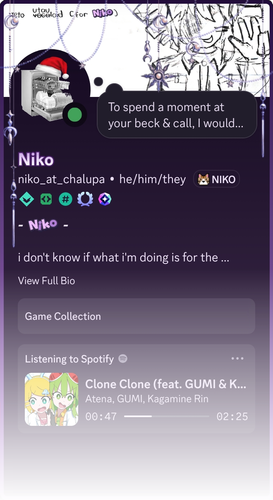

<!--
**niko-at-chalupa/niko-at-chalupa** is a ✨ _special_ ✨ repository because its `README.md` (this file) appears on your GitHub profile.

Here are some ideas to get you started:

- 🔭 I’m currently working on ...
- 🌱 I’m currently learning ...
- 👯 I’m looking to collaborate on ...
- 🤔 I’m looking for help with ...
- 💬 Ask me about ...
- 📫 How to reach me: ...
- 😄 Pronouns: ...
- ⚡ Fun fact: ...
-->

# Hello!!

    

  

 

i'm , programmer/student who's into **web development** *(mostly backend)*, **game development** and **other stuff**!

i like to make things for myself, as i don't know the proper way to do things, so most of my projects are just experiments

the stuff i make is usually modular, so you can use parts of it in your own projects!

<!--  will set a link for this later-->