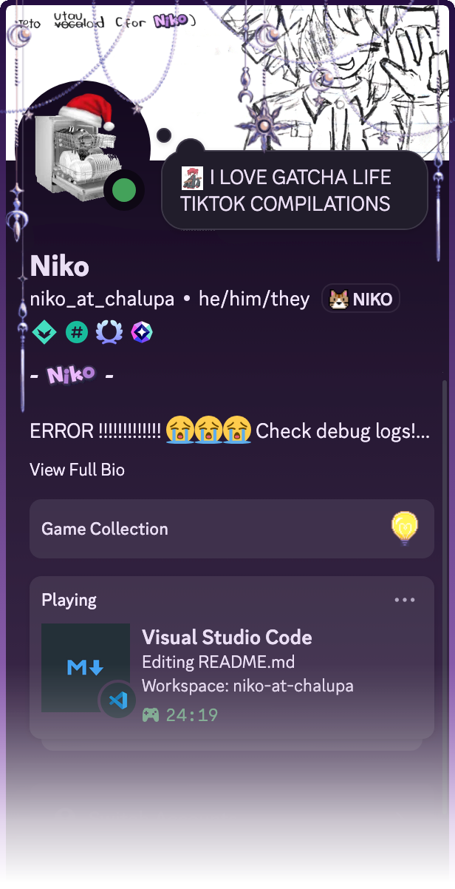

<!--
**niko-at-chalupa/niko-at-chalupa** is a ✨ _special_ ✨ repository because its `README.md` (this file) appears on your GitHub profile.

Here are some ideas to get you started:

- 🔭 I’m currently working on ...
- 🌱 I’m currently learning ...
- 👯 I’m looking to collaborate on ...
- 🤔 I’m looking for help with ...
- 💬 Ask me about ...
- 📫 How to reach me: ...
- 😄 Pronouns: ...
- ⚡ Fun fact: ...
-->

# Hello!!

<strong>what i use</strong>

 <u><i>Languages I know (ranked by how much I use them)</i></u> 

| Rank | Language | Proficiency | Use Cases |
|------|----------|-------------|-----------|
| 1 |  | ⭐⭐⭐⭐⭐ | Scripting, and mostly everything |
| 2 |  | ⭐⭐⭐⭐ | Roblox Studio|
| 3 |  | ⭐⭐⭐⭐ | Web development, frontend |
| 4 |  | ⭐⭐⭐ | Web markup |
| 5 |  | ⭐⭐⭐ | Web styling |
| 6 |  | ⭐ | Still learning |

 <u><i>Operating Systems</i></u> 

 
   

 

---

i'm <code></code>, programmer/student who's into **web development** *(mostly backend)*, **game development** and **other stuff**!

---

<code>
i'm <code>niko_at_chalupa</code>
on discord
</code>

 
 
 
