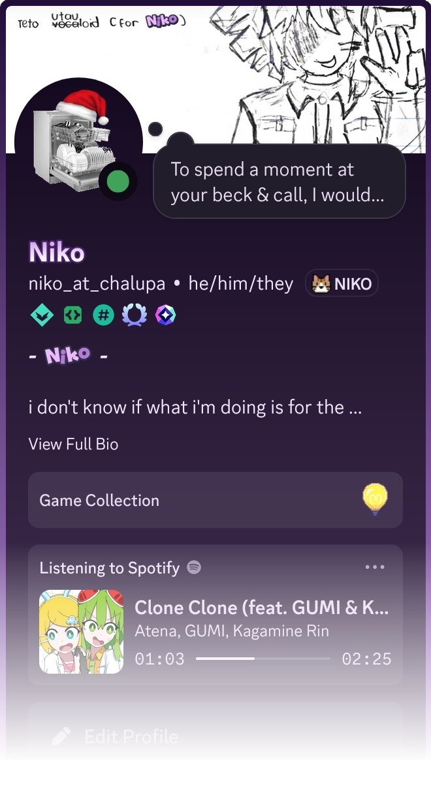

<!--
**niko-at-chalupa/niko-at-chalupa** is a ✨ _special_ ✨ repository because its `README.md` (this file) appears on your GitHub profile.

Here are some ideas to get you started:

- 🔭 I’m currently working on ...
- 🌱 I’m currently learning ...
- 👯 I’m looking to collaborate on ...
- 🤔 I’m looking for help with ...
- 💬 Ask me about ...
- 📫 How to reach me: ...
- 😄 Pronouns: ...
- ⚡ Fun fact: ...
-->

   

# Hello!!
i'm Niko, programmer/student who's into ~~web development~~ *(mostly backend)*, game development and other *(fun)* stuff!

i like to make things for myself, as i don't know te proper way to do things, so most of my projects are just experiments and learning experiences.

i really like to make my stuff modular and reusable, so if you find something useful, feel free to use it in your own projects *(please)*!!